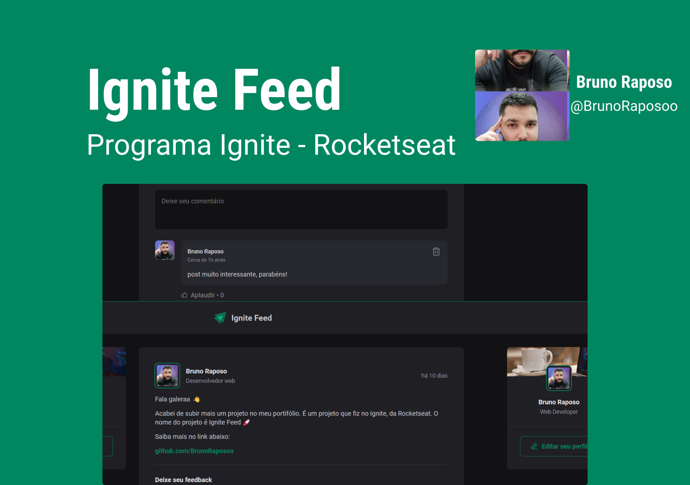

<h1 align="center">
    
</h1>

  <a href="#rocket-tecnologias">Tecnologias</a>&nbsp;&nbsp;&nbsp;|&nbsp;&nbsp;&nbsp;
  <a href="#-projeto">Projeto</a>&nbsp;&nbsp;&nbsp;|&nbsp;&nbsp;&nbsp;
  <a href="#-layout">Layout</a>&nbsp;&nbsp;&nbsp;|&nbsp;&nbsp;&nbsp;
  <a href="#memo-licença">Licença</a>

 

  

 

  

## 🚀 Tecnologias

Esse projeto foi desenvolvido com as seguintes tecnologias:

- [ReactJS](https://pt-br.reactjs.org/)
- [TypeScript](https://www.typescriptlang.org/)

## 💻 Projeto

Projeto elaborado para criar uma nova rede social, apilidada de Ignite Feed, que permite interação entre os usuários por meio de textos.

## 🔖 Layout

Você pode visualizar o layout do projeto através [desse link](https://www.figma.com/file/Syt7mtEUpYki5H5hKfjLro/Ignite-Feed-(Community)?node-id=0-1&t=tqItXgf8xkW1AUuB-0). Lembrando que você precisa ter uma conta no [Figma](http://figma.com/) para acessá-lo.

## Licença

Esse projeto está sob a licença MIT. Veja o arquivo [LICENSE](LICENSE.md) para mais detalhes.

---